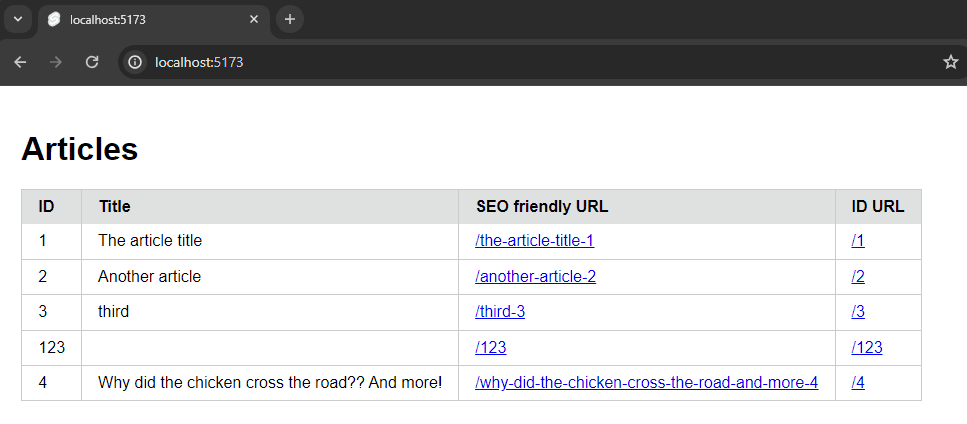

# svelte-selfheal

A simple Svelte package inspired by [this video from Aaron Francis](https://www.youtube.com/watch?v=a6lnfyES-LA) and heavily based on [a similar package for Laravel](https://github.com/lukeraymonddowning/self-healing-urls).

It allows you to redirect users to a canonical and SEO-friendly URL for a page, even if the slug is altered at any point or doesn't exist at all.



### Example

Canonical URL: `https://my-app.com/blog/my-fancy-title-5312`

The following URLs would still redirect to the correct page

- `/blog/my-fancy-title-5312` _(original)_
- `/blog/my-fancy-but-spelled-wrong-title-5312`
- `/blog/5312`
- `/blog/-5312`
- `/blog/THIS should NOT be r3alURL   -5312`

## Installation

Install this package using any of the popular package managers.

```
npm i svelte-selfheal
```

```
pnpm add svelte-selfheal
```

```
yarn add svelte-selfheal
```

## Usage

Once installed, export a healer:

```ts
import { selfheal } from 'svelte-selfheal';

export const healer = selfheal();
```

Now you can use the self-healing functions anywhere across your app.

### Example +page.server.ts

Inside your load function you want to

1. Import the `healer` and destructure the most important functions

```ts
const { identifier, shouldRedirect, reroute, create } = healer;
```

2. Separate the identifier from the slug using the handler you defined on creation

```ts
const { identifier: id } = identifier.separate(params.id);
```

3. Query the database using the ID and see if something is found

```ts
const article = db.articles.find((article) => String(article.id) === id);
if (!article) throw error(404, `Article ${identifier} not found`);
```

4. Compare the DB slug to your current URL (and redirect if they're differerent)

```ts
const slug = create(article.title, article.id);

// You can either use the built-in rerouter
reroute(slug, params.id);

// Or manually check and handle the error yourself
if (shouldRedirect(slug, params.id)) throw redirect(301, slug);
```

Now you are guaranteed to either be on the `404` page because no content with that ID is found or you have been redirected to use the canonical slug for this entity.

### Complete example

```ts
import { error, redirect } from '@sveltejs/kit';
import type { PageServerLoad } from './$types.js';

import { healer } from '$lib/selfheal.js';
import { db } from '$lib/db.js';

export const load: PageServerLoad = async ({ params }) => {
	const { identifier, shouldRedirect, reroute, create } = healer;

	const { identifier: id } = identifier.separate(params.id);

	const article = db.articles.find((article) => String(article.id) === id);
	if (!article) throw error(404, `Article ${identifier} not found`);

	const slug = create(article.title, article.id);

	reroute(slug, params.id); // or throw manually
	if (shouldRedirect(slug, params.id)) throw redirect(301, slug);

	return { article, slug: params.id };
};
```

Don't worry if your "slug" isn't URL friendly; the package will take care of
formatting it for you whenever you call `create()`. In fact, it doesn't even have to be unique because the
defined unique identifier for your model will also be included at the end.

## Limitations

By default, the package requires that your unique identifier (such as the `id` or `uuid` column)
not have any `-` characters. You can implement your own `IdentifierHandler` as detailed in the next section.

As of now, all URL parameters are removed during redirect but this will be fixed in a future release.

## Configuration

During initialization you can configure the `healer` by passing in functions to handle its operations, or use its sensible defaults.

By default, the package uses

| Function                      | Method | Description                                                                                                                                 |
| ----------------------------- | ------ | ------------------------------------------------------------------------------------------------------------------------------------------- |
| sanitize()                    | Kebab  | Trims, replaces spaces with hyphens, removes multiple hyphens, removes hyphens at the start and end of the string and converts to lowercase |
| shouldRedirect() && reroute() | Name   | Compares the canonical and current routes by their names using a simple `===`                                                               |
| identifier()                  | Hyphen | Appends the ID to the slug using a hyphen `-`                                                                                               |

You can however change any of these individually, within the limitations mentioned above.

```ts
export const healer = selfheal({
	sanitize: (slug) => {
		/* ... */
	},
	identifier: {
		join(slug, identifier) {
			/* ... */
		},
		separate(slug) {
			/* ... */
		}
	},
	shouldRedirect: (slug, identifier) => {
		/* ... */
	},
	reroute: (slug, identifier) => {
		/* ... */
	}
});
```

### Using a custom `IdentifierHandler`

If you need to customize how a slug is joined to a model identifier (which by default is just a hyphen),
you can create your own `IdentifierHandler` that returns a `join()` and a `separate()` function and supply itduring the initialization of your `healer`.

Here is an example using a `_` instead

```ts
export const healer = selfheal({
	identifier: {
		join(slug, identifier) {
			return `${slug}_${identifier}`;
		},
		separate(slug) {
			const [identifier, ...rest] = slug.split('_').reverse();
			return {
				identifier,
				slug: rest.reverse().join('_')
			};
		}
	}
});
```

This would result in URLs like `/my-fancy-title_123`, depending of course on how your sanitizer works.

## License

Licensed under the [MIT license](https://github.com/dominic-schmid/svelte-selfheal/blob/main/LICENSE.md).
