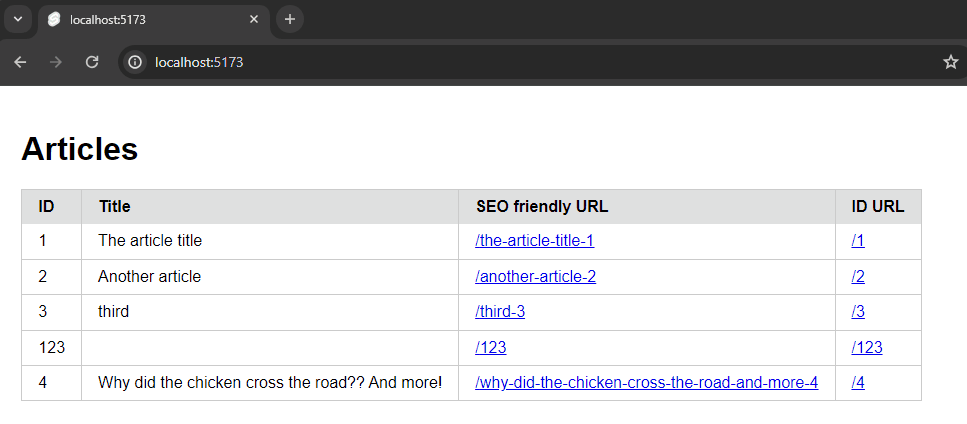

# svelte-selfheal

**[Live demo](https://selfheal.js.org)** · [npm](https://www.npmjs.com/package/svelte-selfheal) · [GitHub](https://github.com/dominic-schmid/svelte-selfheal)

Self-healing URLs for SvelteKit. A route like `/blog/my-fancy-title-5312` looks right in
search results; your load still fetches article `5312`. Break the slug and the library
sends a `301` to the canonical path — as long as the ID is still in the URL.

Inspired by [Aaron Francis](https://www.youtube.com/watch?v=a6lnfyES-LA) and
[Laravel self-healing URLs](https://github.com/lukeraymonddowning/self-healing-urls).



Canonical: `/blog/my-fancy-title-5312`. These all redirect to it:

- `/blog/my-fancy-but-spelled-wrong-title-5312`
- `/blog/5312`
- `/blog/-5312`
- `/blog/THIS should NOT be r3alURL   -5312`

Titles change. Links get shared with typos. URLs get truncated. The ID stays stable; the
slug does not. Zero runtime dependencies — Svelte 5 peer only. The library never imports
SvelteKit; you call `error()` and `redirect()` in your own `load` functions.

## Install

```bash
pnpm add svelte-selfheal
```

## Use

Define a healer and a heal layer once (e.g. `$lib/healer.ts`):

```ts
import { selfheal } from 'svelte-selfheal';
import { getArticle } from '$lib/db.js';
import type { Article } from '$lib/db.js';

export const healer = selfheal();

export const healArticle = healer.layer<Article>({
  fetch: getArticle,
  segment: (article) => ({ identifier: article.id, slug: article.title })
});
```

**Single segment** (`/[id]`) — `run` parses the param, fetches the row, compares the slug:

```ts
import { healArticle, healer } from '$lib/healer.js';
import { error, redirect } from '@sveltejs/kit';

export const load = async ({ params, url }) => {
  const result = await healer.run(healArticle(params.id), url.searchParams);
  if (result.notFound) error(404, 'Article not found');
  if (result.redirect) redirect(301, result.redirect);

  const [article] = result.resources;
  return { article };
};
```

**Nested segments** (`/[id]/details/[innerId]`) — `stack` heals every layer in one redirect,
including a wrong parent slug:

```ts
import { healArticle, healer } from '$lib/healer.js';
import { error, redirect } from '@sveltejs/kit';

export const load = async ({ params, url }) => {
  const result = await healer.stack(
    [healArticle(params.id), 'details', healArticle(params.innerId)],
    url.searchParams
  );
  if (result.notFound) error(404, 'Article not found');
  if (result.redirect) redirect(301, result.redirect);

  const [, article] = result.resources;
  return { article };
};
```

## Behavior

- Wrong or missing slug, valid ID → `301` to canonical.
- Nested routes: each heal layer fixes its own segment; static path parts (e.g. `'details'`) stay as written.
- Query strings carry over on redirect.
- Fetch miss → `notFound: true`; you call `error(404)`.

### Deploying

`redirect(301)` in `load` runs on the **server**. Use an adapter that executes server
`load` at request time — `adapter-vercel`, `adapter-node`, `adapter-cloudflare`, and
similar.

`adapter-static` with full prerender is a poor fit for self-healing URLs: build output
cannot emit real HTTP 301s. Prerender only bakes client-side redirect stubs for paths you
enumerate ahead of time. Canonical pages and marketing sites without dynamic slug healing
are fine on static; arbitrary wrong URLs are not.

This repo's demo uses `@sveltejs/adapter-vercel` on Vercel so try links show real `301`
responses.

Default hyphen IDs cannot contain `-` (e.g. UUIDs). Use `TildeIdentifierHandler` for those.

## Customize

Pass only the strategies you need; everything else keeps the default:

```ts
import {
  selfheal,
  SnakeSlugSanitizer,
  CaseInsensitiveComparator,
  TildeIdentifierHandler
} from 'svelte-selfheal';

export const healer = selfheal({
  sanitize: SnakeSlugSanitizer,
  isEqual: CaseInsensitiveComparator,
  identifier: TildeIdentifierHandler
});
```

| Export                        | Behavior                                |
| ----------------------------- | --------------------------------------- |
| `KebabSlugSanitizer`          | kebab-case, diacritic folding (default) |
| `SnakeSlugSanitizer`          | snake_case                              |
| `PassthroughSlugSanitizer`    | trim only — slug already normalized     |
| `NamedComparator`             | strict `===` (default)                  |
| `CaseInsensitiveComparator`   | ignore casing differences               |
| `HyphenIdentifierHandler`     | `slug-id` (default)                     |
| `UnderscoreIdentifierHandler` | `slug_id`                               |
| `TildeIdentifierHandler`      | `slug~id` — safe for UUIDs              |

## Development

The npm package and the demo site share this repo:

```bash
pnpm install
pnpm dev          # http://localhost:5173
pnpm test
pnpm check
pnpm lint
pnpm knip
pnpm build        # production build (demo deploys to Vercel)
pnpm package      # dist/ for npm
```

Set `PUBLIC_SITE_URL` (no trailing slash) in your deployment environment — canonical URLs
and Open Graph tags read it at runtime. On Vercel, add it under Project → Settings →
Environment Variables.

```bash
PUBLIC_SITE_URL=https://your-project.vercel.app pnpm dev
```

### Deploy the demo

The demo deploys to **Vercel** with `@sveltejs/adapter-vercel`. Connect the GitHub repo;
Vercel detects SvelteKit automatically. Set `PUBLIC_SITE_URL` to your production origin
(e.g. `https://your-project.vercel.app`).

Demo load functions: [`src/routes/[id]/+page.server.ts`](src/routes/[id]/+page.server.ts),
[`src/routes/[id]/details/[innerId]/+page.server.ts`](src/routes/[id]/details/[innerId]/+page.server.ts).

Copy-ready route layouts in [`examples/`](examples/):

| Folder | API | Route shape |
| ------ | --- | ----------- |
| [`single-segment-run`](examples/single-segment-run/) | `healer.run()` | `/[id]` |
| [`nested-stack`](examples/nested-stack/) | `healer.stack()` | `/[id]/details/[innerId]` |
| [`sync-canonical-redirect`](examples/sync-canonical-redirect/) | `healer.canonicalRedirect()` | data already in `load` |

## License

[MIT](https://github.com/dominic-schmid/svelte-selfheal/blob/main/LICENSE.md)
